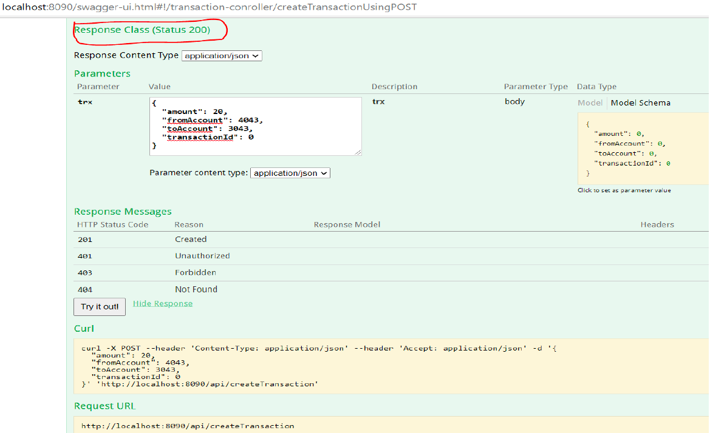

# Bank Operations API App Deployment into Kubernetes and Docker Guide
## Overview

This is a sample app to deploy into Kubernetes and Docker both. This is a multitier bank operations api app and can deploy into Docker or Kubernetes. This is a Bank operations multitier app (Swagger UI using HTML /Spring Boot Rest Service/Mysql DB) which expose many end points of various bank and user operations on Swagger UI.
## Key Considerations for this app

* Architecture – it is 3 tier Architecture app (Frontend /Middle tier business logic / DB) and app workload have deployed into Docker and Kubernetes both and tested from both.
* UI Layer – Secured Swagger API Page to Test API – Application server port is 8090
* This swagger UI page is secured page and can be access via user/password login only. 
* Use Springboot-JPA framework to generate mysql db tables on runtime.
* I have used minikube and docker desktop for my local testing and use minikube tunneling /port forwarding to test my applications locally.


# Kubernetes / Docker Deployment steps

**Prerequisite**  : Following components should install into laptop/local computer before deployment process start.

* **JDK 8** or (8+) version.
* **Maven CLI** - installed to execute maven project of Bank App and deploy docker image via maven.
* **Docker CLI** and Docker Demon – to execute docker commands and to host docker images
* **Kubectl CLI** - installed to execute Kubernetes Commands
* **Minikube** – for personal device / may not needed if deploying into cloud (Aws EKS/AKS/GKE etc)

## App workload Deployment in Kubernetes steps

1. Start Kubernetes – for local minikube use command from terminal `minikube start` . To Launch Kubernetes dashboard use command `minikube dashboard` after minikube start. or Login to your Kubernetes cluster in cloud.

2. Create Kubernetes secrets var for user name , password and mysql db url using following commands.

```
# create secret for root
kubectl create secret generic mysql-root-pass --from-literal=password=<password>

# create secret for sql 
kubectl create secret generic mysql-user-pass --from-literal=username=<username> --from-literal=password=<password>

kubectl create secret generic mysql-db-url --from-literal=database=polls --from-literal=url='jdbc:mysql://mysql-service:3306/test?useSSL=false&serverTimezone=UTC&useLegacyDatetimeCode=false'

# Check the secrets use command 
kubectl get secrets
```
3. deploy MySQL by applying the yml configuration from \bankservice\Kubernetes-manifest directory
`kubectl apply -f deployments/mysql-deployment.yml`

4. Check mysql service deployment and persistent volume by following commands
```
kubectl get services
kubectl get persistentvolumeclaims
```

5. deployment manifest for the Bank Spring Boot app by applying the yml configuration from \bankservice\Kubernetes-manifest directory.
`kubectl apply -f deployments/ bank-app.yml`

6. Check bank app service deployment and pods(2) by following commands
```
kubectl get services
kubectl get pods
```
7. Get service url of bank app by following command
`minikube service bank-app-server –url`

8. Execute below command to port forward to run service
`kubectl port-forward service/bank-app-server 8090:8090`

9. Execute curl command to check container status
`curl -X GET --header 'Accept: application/json' 'http://<service url>:8090/actuator/health'`

**Note** -  Can refer kubernetes tutorial for advance topic of load balancer and ingress configuration to access swagger from outside, have added load balancer configuration in bank-app.yml and can check into Kubernetes Dashboad.

For exposing services to external IP can follow these links ,can refine further this app –

* [Expose-external-ip-address in kubernetes](https://kubernetes.io/docs/tutorials/stateless-application/expose-external-ip-address/)
* [Connecting-frontend-backend in kubernetes](https://kubernetes.io/docs/tasks/access-application-cluster/connecting-frontend-backend/)
* [Ingress](https://kubernetes.io/docs/concepts/services-networking/ingress)


## App workload Deployment in Docker steps

1. Git project repo checkout into local machine and go into the root directory of project **\bankservice**  
2. Execute command `mvn clean install` from command prompt/terminal , this will compile and build docker images into local docker repo. Use command `docker images` to check
3. Install and run mysql 5.6 into docker using following command - 

```
docker run --name mysql-service -e MYSQL_ROOT_PASSWORD=password -e MYSQL_DATABASE=test -e MYSQL_USER=aj -e MYSQL_PASSWORD=password -d mysql:5.6
```

4. Start bank app image and link with mysql db image using following command.

`docker run -d -p 8090:8090 --name bankservice-mysql --link mysql-service:mysql bankservice:0.0.1`

5. Execute command `docker ps` to check both container status and wait for container to start. 

6. Use url localhost:8090/swagger-ui.html#/ to launch swagger UI and enter **username= myuser** and **password = password** to login. Can test all endpoint from swagger UI. 

**Note** -  Refer below endpoint table for create transaction json payload sample.

You can also Directly download docker image from public docker hub , execute below command , before running this command install mysql image (see step3) –

`docker run -d -p 8090:8090 --name bankservice-mysql --link mysql-service:mysql aj4184/bank:latest`


## App running and testing into the browser steps

Please use following login details to login :

* Launch swaggerui into local browser using **url - http://< url >: < port >/swagger-ui.html#/**
* Enter **Username as “myuser”**
* Enter **Password as “password”**

## Refer Below screen shot


## Service Layer 
Rest Service API End Points (all input /output in JSON) – Spring Boot based microservice with docker file and docker plugin to build and deploy docker image in port 8090

## Bank API End points

**Operations** | **API End Points /Type**  | **Descripttion**  
-----|-----|-----
operation-handler | GET /actuator/health | get server health
operation-handler | GET /actuator/info |  get server info
Transaction-controller | POST /api/adduser | add user name and email
Transaction-controller | GET /api/allUser|  get all added users
Transaction-controller | POST /api/createTransaction | {"amount": 10, "fromAccount": 222340, "toAccount": 43420, "transactionId": 0 }
Transaction-controller | GET /api/view/{id} |  view single transaction id details
Transaction-controller | GET /api/viewAllTransaction |  view all transaction details
web-mvc-links-handler | GET /actuator |  get all webmvc link handler parameters


## Data Layer 
Used mysql 5.6 docker image to build DB server for Rest service and persist data.


## Test Result 

* **API End Point - AddUser** 


* **API EndPoint Alluser** 


* **API EndPoint – CreateTransaction**



* **API EndPoint – viewTransactionById**


* **API Endpoint – viewAlltransaction** 


* **API Endpoint - \actuator\health**


